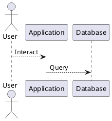

# Architecture Documentation - Astro + Starlight

Documentation architecture avec **Astro** + **Starlight** - Moderne, rapide et zéro configuration! 🚀

## ✨ Stack technique

- **[Astro](https://astro.build/)** - Framework SSG ultra-rapide
- **[Starlight](https://starlight.astro.build/)** - Thème documentation Astro
- **[PlantUML](https://plantuml.com/)** - Diagrammes en texte
- **[DrawIO CLI](https://github.com/jgraph/drawio-desktop)** - Conversion DrawIO → SVG
- **GitHub Actions** - CI/CD automatisé
- **GitHub Pages** - Hosting gratuit

## 🚀 Démarrage rapide

### Installation locale

```bash
# 1. Installer Node.js (si ce n'est pas fait)
# https://nodejs.org/ (v20+)

# 2. Cloner le repo
cd github-pages

# 3. Installer les dépendances
npm install

# 4. Installer les outils (optionnel pour tester localement)
# macOS:
brew install plantuml

# Linux:
sudo apt-get install plantuml

# DrawIO CLI:
npm install -g @drawio/cli
```

### Développement local

```bash
# Démarrer le serveur de développement (hot-reload)
npm run dev
```

→ Ouvrez http://localhost:3000

### Build pour production

```bash
# Générer les diagrammes
npm run build:diagrams

# Build du site statique
npm run build
```

→ Site généré dans `dist/`

## 📁 Structure des fichiers

```
.
├── src/
│   ├── content/docs/          # Vos pages markdown
│   │   ├── index.md           # Page d'accueil
│   │   ├── architecture/      # Section architecture
│   │   └── component-a/       # Section composants
│   ├── assets/
│   │   └── diagrams/          # Images générées (auto)
│   └── styles/
│       └── custom.css         # Styles personnalisés
│
├── diagrams/                   # Source des diagrammes
│   ├── *.puml                 # Diagrammes PlantUML
│   └── *.drawio               # Diagrammes DrawIO
│
├── package.json               # Dépendances Node.js
├── astro.config.mjs           # Config Astro
├── build-diagrams.sh          # Script de build des diagrammes
└── .github/
    └── workflows/
        ├── deploy.yml         # Deploy automatique
        └── preview.yml        # Preview sur PR
```

## 📝 Ajouter du contenu

### Créer une nouvelle page

1. Créez `src/content/docs/section/page.md`:

```markdown
---
title: Ma page
description: Description pour le SEO
---

# Titre niveau 1

Votre contenu ici...
```

2. Mettez à jour la navigation dans `astro.config.mjs`

### Ajouter des diagrammes

#### PlantUML

Créez `diagrams/mon-diagramme.puml`:



Référencez dans votre markdown:

```markdown

```

#### DrawIO

1. Éditez sur [diagrams.net](https://www.diagrams.net/)
2. Téléchargez en `.drawio`
3. Sauvegardez dans `diagrams/`
4. Les images SVG sont auto-générées au build!

**Référencez:**

```markdown

```

## 🔄 Workflow automatisé

### ✅ Push sur main → Auto-déploie

```bash
git add .
git commit -m "Update documentation"
git push origin main
```

**Automatiquement:**
1. Build les diagrammes (PlantUML + DrawIO)
2. Build le site Astro
3. Déploie sur GitHub Pages

### Pull Request → Preview

Chaque PR génère un aperçu (artifacts tab)

## 🎨 Personnalisation

### Thème

Modifiez `astro.config.mjs`:

```javascript
starlight({
  title: 'Votre Titre',
  description: 'Votre description',
  defaultLocale: 'fr',
  // ...
})
```

### CSS personnalisé

Éditez `src/styles/custom.css`

## 📚 Documentation

- [Astro Docs](https://docs.astro.build)
- [Starlight Guide](https://starlight.astro.build/)
- [PlantUML Language](https://plantuml.com/guide)

## 🔐 Configuration GitHub Pages

**Une seule fois:**

1. Allez dans **Settings** → **Pages**
2. Source: **GitHub Actions**
3. (Devrait être auto-détecté)

## ✅ Résumé

1. Éditez les `.md` dans `src/content/docs/`
2. Ajoutez les diagrammes dans `diagrams/`
3. `npm run dev` pour tester localement
4. `git push origin main` pour publier automatiquement

**Voilà!** Votre doc est publiée sur GitHub Pages! 🎉

---

**Besoin d'aide?** Consultez les logs GitHub Actions (onglet "Actions" du repo).
