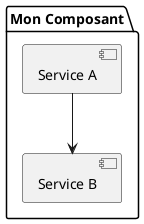

# 📊 Galerie de diagrammes

## Diagramme d'organisation


**Source:** `organization.drawio`

---

## 🎨 Comment ajouter des diagrammes

### PlantUML

Créez un fichier `.puml` dans le dossier `diagrams/`:



Puis référencez dans le markdown:
```markdown

```

### DrawIO

1. Éditez sur [diagrams.net](https://www.diagrams.net/)
2. Téléchargez en format `.drawio`
3. Mettez dans le dossier `diagrams/`
4. Les images SVG sont auto-générées

---

## 🔧 Build des diagrammes

```bash
npm run build:diagrams
```

Cela convertit tous les `.puml` et `.drawio` en `.svg`.
